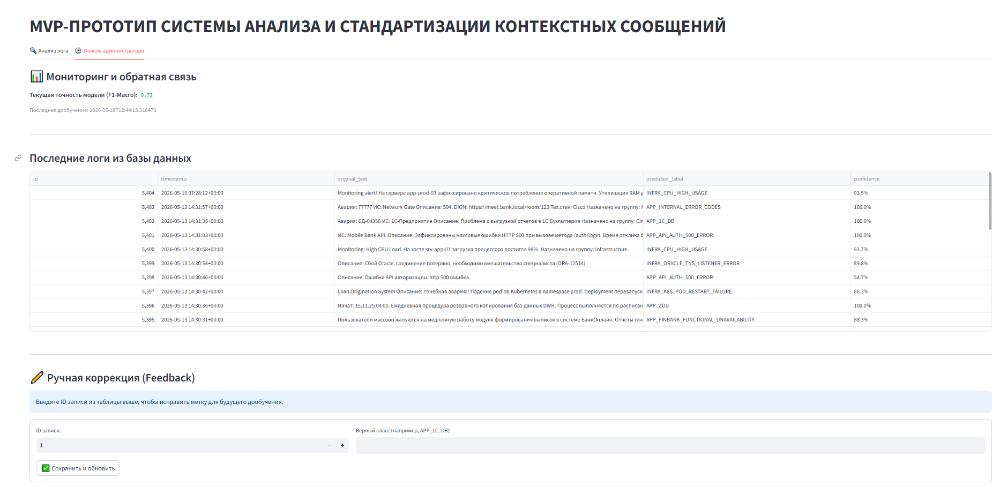
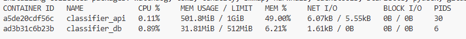
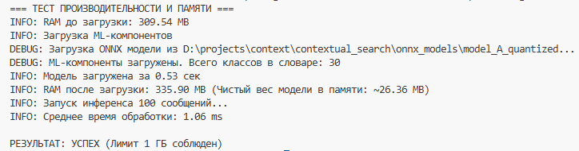
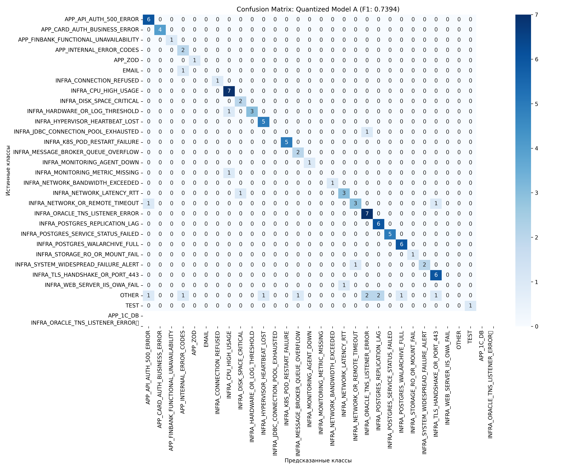
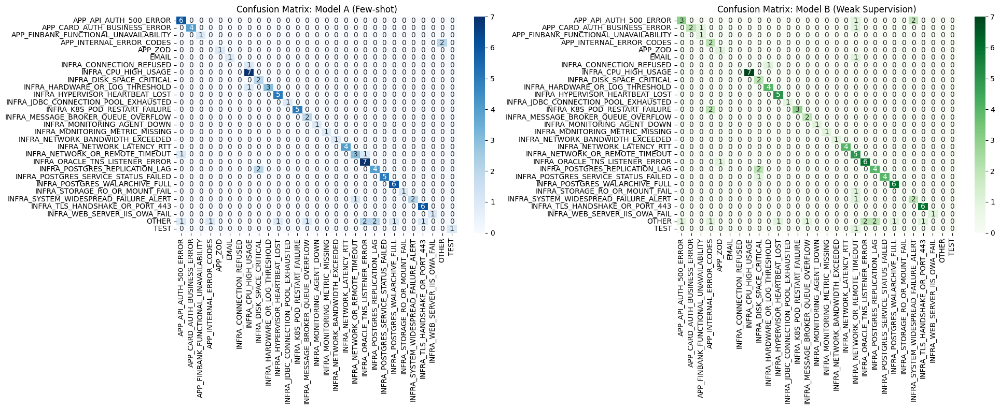

# Notebooks-for-diplom

Это исследования из MVP-проекта, разработанного в рамках производственной практики.

Цель проекта — создание нейросетевого сервиса для автоматической классификации и приведения к единому шаблону текстовых сообщений.

## Научная новизна и задача исследования

В рамках работы было проведено сравнение двух подходов к обучению модели на базе архитектуры **RuBERT-tiny:**

1. **Model A (Supervised/Few-shot):** Обучение на малой экспертной выборке (500 строк «Золотого стандарта»).
2. **Model B (Weak Supervision):** Обучение на массиве данных (45 500 строк), размеченном автоматически с помощью алгоритма кластеризации K-Means.

**Итоговый результат:** Модель А показала F1-macro = 0.82, что стало эталонным значением (Baseline) для системы.

## Технологический стек

* **Язык:** Python 3.11.9
* **ML:** Transformers, PyTorch, ONNX Runtime, Scikit-learn, Optimum.

## Структура проекта

```bash
├── images/ #скриншоты, используемые в документации
├── notebooks/
│   ├── clustering_tests/
│   │   │── test_samples/
│   │   │   │── GOLD_STANDARD_500_done.csv # золотой стандарт размеченные данные
│   │   │── 01-Research_Clustering_Metrics.ipynb # анализ сырых данных (метод локтя, t-sne)
│   │   │── 02_Research_Parsing_And_Clustering.ipynb # анализ очищенных данных -> доказательство необходимости парсинга
│   ├── data/
│   │   │── processed/
│   │   │   │── gold_test_holdout.csv # для проверки f1 - 100 данных о которых не знает модель из test-samples/GOLD_STANDARD_500_done.csv
│   │   │   └── tru_weak_train_26000k.csv # датасет для обучения модели Б
│   ├── new_models/
│   │   │── 01_data_preparation_and_model_A.ipynb # обучение модели А
│   │   │── 02_weak_supervision_model_B.ipynb # обучение модели Б
│   │   │── 03_final_comparison.ipynb # сравнение моделей
│   │   └── 04_quantization_model_a.ipynb # квантизация модели А
│   ├── researches_for_autumn_practic/
│   │   ├── 01-EDA-and-Clustering.ipynb  # Анализ данных
│   │   ├── 02-Optimization-and-Benchmarking.ipynb # Анализ данных
│   │   ├── 03-Classifier-Training.ipynb # Подготовка данных для обучения
│   │   ├── 04_Model_Training.ipynb # Обучение моделей
│   │   ├── 05_Model_Inference.ipynb # Проверка работы
│   │   ├── 06-Fine-Tuning-and-Evaluation.ipynb # Тестирования изменения порога ошибок
│   │   ├── 07-Model-Quantization.ipynb # Квантинизация моделей
│   │   ├── 08-Retraining-Pipeline.ipynb # Дообучение моделей
│   │   │── 09-KPI-metrics.ipynb # расчет бизнес-метрик проекта (доля автоматизации, снижение времени обработки)
│   │   └──10-Simulate-New-Pattern.ipynb # Симуляция MLOps демонстрация подхода **Human-in-the-Loop**. Сценарий: поиск новых кластеров в логах (например, "Сбой 1С"), которые система не распознала, для последующего добавления в обучающую выборку.
├── README.md # документация
```


## Интерфейс оператора (Streamlit)

Фронтенд предназначен для демонстрации работы системы и ручной коррекции меток. Запускается локально (для разработки) или как отдельный сервис



## **Системные требования**

Проект оптимизирован под требования ТЗ:

* **CPU**: min 0.5 cores.
* **RAM**: min 1 GB.
* **HDD**: ~1.5 GB (Docker image size). 


## Ресурсная эффективность и нагрузка



# Cоблюдения лимитов RAM:

**Ожидаемый результат**:



## **Результаты и Метрики**

### Сравнение моделей (на Hold-out тесте 100 строк)
Модели прошли процесс квантизации (INT8) и дообучения на полных данных.

| Метрика | Model A (Expert Gold) | Model B (Weak Supervision) |
| :--- | :--- | :--- |
| **Macro F1-score** | **0.82** | 0.67 |
| **Accuracy** | **0.81** | 0.74 |
| **Inference Time** | 28 ms | 28 ms |
| **RAM Usage** | ~350 MB | ~350 MB |

Сравнение исходной квантизированной модели и дообученной:

| Метрика | Модель А (v1 - Gold) | Модель А (v2 - Retrained) |
| :--- | :--- | :--- |
| **Macro F1-score** | **0.82** | 0.74 |
| **Кол-во классов**| 29 | 31 |
| **RAM Usage** | ~350 MB | ~380 MB |

**Примечание**: Снижение F1 до 0.74 при ретрейне обусловлено расширением словаря меток и переходом от "стерильных" данных к реальному потоку инцидентов.

## Матрица ошибок (Confusion Matrix v2)



### Параметры эксплуатации
*   **Confidence Threshold:** `0.8` (Оптимальный баланс между точностью и полнотой).
*   **KPI Автоматизации:** `~98.8%` (доля корректно обработанных инцидентов, включая маршрутизацию).

### Матрица ошибок (Confusion Matrix)

